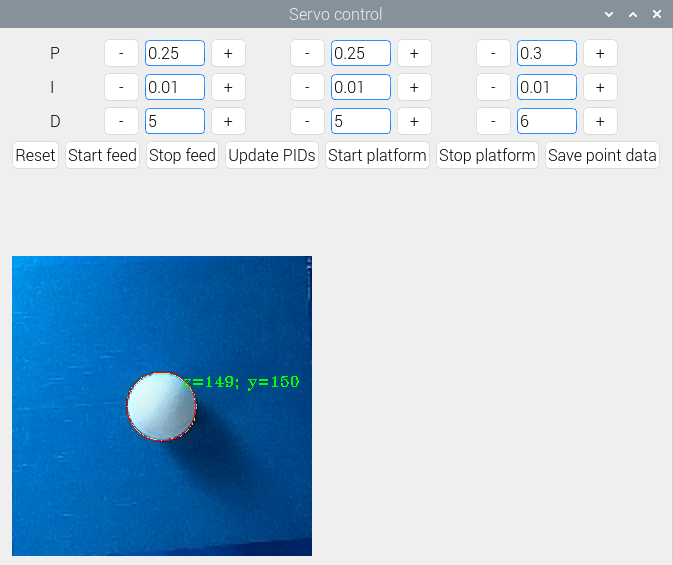
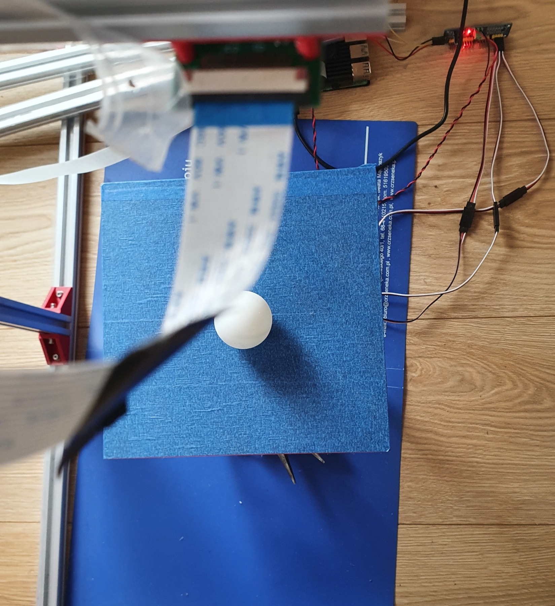
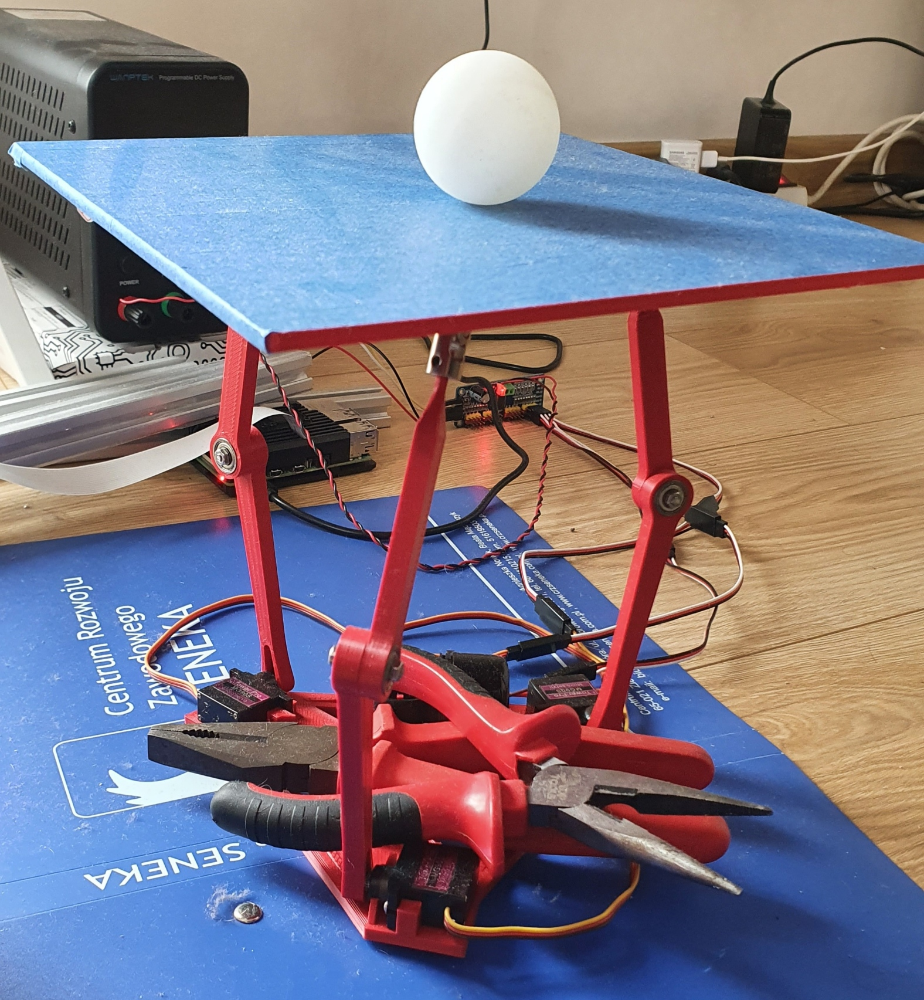

# Platform for balancing a ping pong ball
Platform that balances a ping pong ball based on live camera feed and pid controller.

BOM:
- Raspberry Pi 4
- Camera compatible with Raspberry Pi
- 9g servo x3
- PSU
- 4x13x5 624ZZ bearing x6
- Universal joint x3
- M3x16 screw x3

